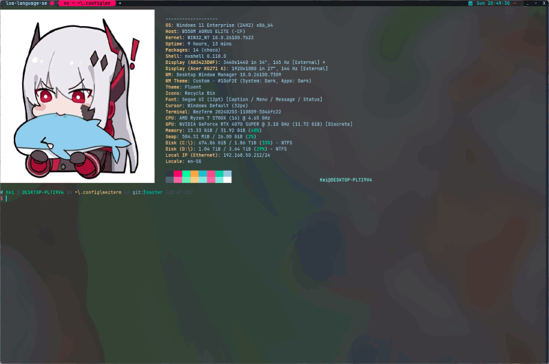

<h2 align="center">My WezTerm Config</h2>

<p align="center">
  
</p>

---

### Screenshots

<p align="center">
  
  
</p>

---

## Feature Toggle System

Your WezTerm config has a **centralized feature toggle system** that allows you to:

- **Config-based**: Toggle features permanently by editing `config/user.json`
- **Runtime**: Toggle features instantly via command palette (F2 → Toggle Feature)
- **Auto-save**: All toggles automatically persist to `config/user.json`
- **JSON-based**: Simple, human-readable format that's safe to edit

---

### How to Toggle Features

#### Option 1: Command Palette (F2) ⭐ Recommended

1. Press `F2` to open command palette
2. Type `Toggle Feature` and select a feature
3. Feature toggles and auto-saves to `config/user.json`
4. Changes persist after WezTerm restart

#### Option 2: Manual Config Edit

Edit `config/user.json` directly:

```json
{
  "features": {
    "workspace-display": false,
    "battery-display": false,
    "animations": false,
    "tab-bar": true,
    "backdrops": true,
    "right-status": true
  },
  "custom": {
    "scrollback_lines": 20000,
    "date_format": "%a %H:%M:%S",
    "cwd_use_git_root": true,
    "hide_active_tab_unseen": true,
    "unseen_icon": "circle"
  }
}
```

**Note**: Changes to `config/user.json` are **persistent** - they survive WezTerm restarts and system reboots. The JSON format is safe to edit by hand and will be validated on load.

---

### Available Features

#### UI Components
- ✓ `left-status` - Left status bar (key table indicator)
- ✓ `right-status` - Right status bar (workspace, cwd, battery, date)
- ✓ `workspace-display` - Show workspace name in right status
- ✓ `cwd-display` - Show current directory in right status
- ✓ `battery-display` - Show battery status in right status
- ✓ `date-display` - Show date/time in right status
- ✓ `tab-bar` - Tab bar at top
- ✓ `new-tab-button` - New tab button on right of tab bar
- ✓ `gui-startup` - Maximize window on startup

#### Visual Effects
- ✓ `backdrops` - Background images with blur effects
- ✓ `background-blur` - Background blur effects (platform-specific)
- ✓ `animations` - UI animations (cursor blink, etc.)
- ✓ `cursor-blink` - Cursor blinking
- ✓ `visual-bell` - Visual bell effect
- ✓ `scroll-bar` - Scroll bar on right

#### Functionality
- ✓ `scrollback` - Scrollback buffer (default: 20000 lines)
- ✓ `hyperlinks` - Clickable hyperlinks in terminal
- ✓ `command-palette` - Command palette (F2)
- ✓ `auto-reload` - Auto-reload config on file change
- ✓ `exit-confirmation` - Window close confirmation

#### Tab Features
- ✗ `tab-index` - Show tab index numbers
- ✓ `tab-title` - Custom tab titles with process icons
- ✓ `last-active-tab` - Switch to last active tab when closing tab

---

### Feature Dependencies

Some features depend on others:
- `workspace-display` depends on `right-status`
- `cwd-display` depends on `right-status`
- `battery-display` depends on `right-status`
- `date-display` depends on `right-status`
- `background-blur` depends on `backdrops`
- `cursor-blink` depends on `animations`

If you disable a parent feature, all its children will also be disabled.

---

## Command Palette (F2)

Custom actions available via command palette:

| Action | Description |
|--------|-------------|
| Activate Copy Mode | Activate copy mode |
| Toggle Fullscreen | Toggle fullscreen |
| Show Debug Overlay | Show debug overlay |
| Search Text | Search text (case-insensitive) |
| **Toggle Feature** | Select and toggle any feature (persisted to config/user.lua) |
| Spawn Tab (Default) | Create new tab |
| Close Current Tab | Close active tab |
| Toggle Tab Bar | Show/hide tab bar |
| Maximize Window | Maximize window |
| Split Vertical | Split pane vertically |
| Split Horizontal | Split pane horizontally |
| Toggle Pane Zoom | Zoom pane |
| Move to Pane | Navigate to pane (up/down/left/right) |
| Scroll Up/Down | Scroll 5 lines |

---

## Theme: Ghost in the Shell

Custom color palette inspired by **Ghost in the Shell** and **Blade Runner**:

| Color | Hex | Usage |
|-------|-----|-------|
| Background | `#0a0e14` | Main terminal bg |
| Text | `#b3e5fc` | Primary text (cyan-tinted) |
| Cyan | `#26c6da` | Holographic UI |
| Green | `#00ff9f` | Matrix/success |
| Crimson | `#dc143c` | Active tabs, alerts |
| Hotpink | `#ff1493` | Warnings, highlights |
| Teal | `#00d4aa` | Icons |

See: [colors/custom.lua](./colors/custom.lua)

---

## Background Modes

This config supports three background modes that can be toggled at runtime:

| Mode | Description | Hotkey |
|------|-------------|--------|
| **Images** | Background images from `backdrops/` folder | `Super+,` / `Super+.` / `Super+/` |
| **Transparent** | Semi-transparent solid color (no images) | `Super+n` |
| **Focus** | Solid color, no image (max readability) | `Super+b` |

**Platform-specific blur:**
- Windows: Acrylic effect
- macOS: Background blur
- Linux (KDE Wayland): `kde_window_background_blur`
- Linux (other compositors): Configure blur externally:
  - Hyprland: use windowrulev2 with blur in hyprland.conf
  - Sway/X11: use picom with blur enabled
  - Other: compositor-specific blur settings

---

## What's Different from Original

- **Theme**: Ghost in the Shell instead of Catppuccin
- **Transparency**: Platform-aware backdrop blur/transparency
- **Colors**: Crimson/hotpink accents throughout
- **Background Modes**: Three modes - Images, Transparent, Focus
- **Command Palette**: F2 (was F2 in original too, but now with custom actions)
- **Feature Toggles**: Complete system with JSON-based persistence (was Lua-based)
- **Config Format**: JSON instead of Lua for user configuration (safer, easier to edit)

---

## Quick Fix: Nushell on Windows

If using Nushell on Windows, add to your Nushell config to prevent scrolling:
```nu
$env.config.shell_integration.osc133 = false
```

---

## Troubleshooting: Git Bash on Windows

If Git Bash fails to launch with exit code 1, check the path in `config/launch.lua`. Common Git Bash installation paths:

- `C:\Program Files\Git\bin\bash.exe`
- `C:\Program Files\Git\usr\bin\bash.exe`
- `C:\Program Files\Git\cmd\bash.exe` (if in PATH)

If using Scoop's Git, you may need to wrap it with cmd.exe:
```lua
args = {
    'cmd.exe', '/c',
    'set MSYS=pathtype=unix&& C:\\Users\\kevin\\scoop\\apps\\git\\current\\bin\\bash.exe -l'
},
```

---

## Quick Fix: Nushell on Windows

If using Nushell on Windows, add to your Nushell config to prevent scrolling:
```nu
$env.config.shell_integration.osc133 = false
```

---

## Credits

- Original: [KevinSilvester/wezterm-config](https://github.com/KevinSilvester/wezterm-config)
- Theme: Ghost in the Shell / Blade Runner (Wallace Corporation)
