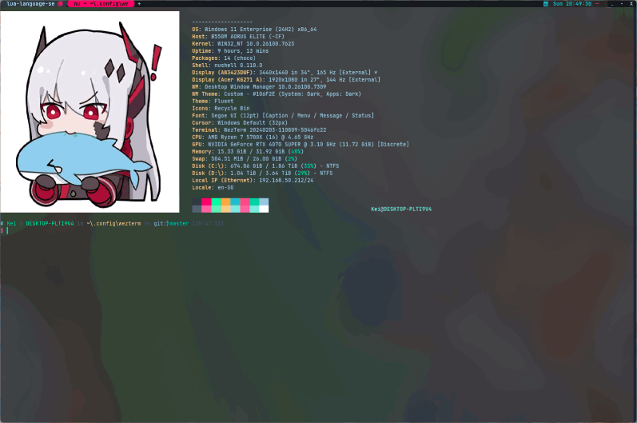
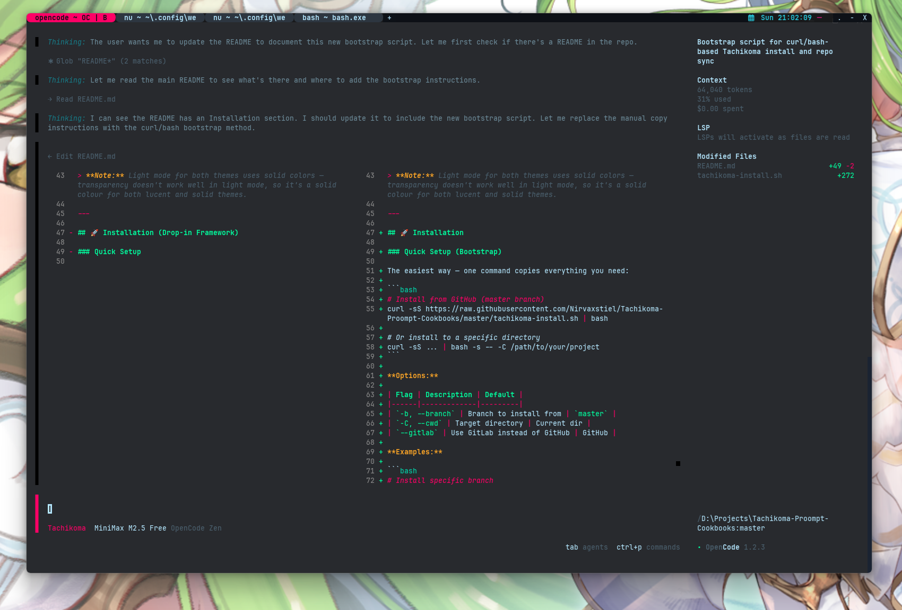

<h2 align="center">My WezTerm Config</h2>

<p align="center">
  
</p>

Nightly-targeted WezTerm config. Feature-toggle architecture (`Features.register` + JSON-backed `user.json`). Config in `config/`, events in `events/`, utilities in `utils/`.

<p align="center">
  
  
</p>

---

## What's in this config

### Feature toggle system

Features are registered in `config/features.lua` with a name, description, optional dependencies, and default state. State lives in `config/user.json` and is loaded before the rest of the config runs.

Two ways to toggle:

- **F2** → command palette → "Toggle Feature" (runtime, persists to JSON)
- **Edit `config/user.json` directly** — safe to hand-edit, reloads on config restart

Dependencies are checked at read time (`Features.is_enabled`), not at toggle time. A feature with a disabled parent shows as disabled even if its own flag is on.

Available features (default state):

**UI**
| Feature | Default | Notes |
|---|---|---|
| `left-status` | on | Key table indicator |
| `right-status` | on | Workspace, cwd, battery, date |
| `workspace-display` | on | Depends on `right-status` |
| `cwd-display` | on | Depends on `right-status`; uses `find_git_dir` |
| `battery-display` | on | Depends on `right-status` |
| `date-display` | on | Depends on `right-status` |
| `tab-bar` | on | |
| `new-tab-button` | on | |
| `gui-startup` | on | Maximize on startup (unless `window-state` is on) |

**Visual**
| Feature | Default | Notes |
|---|---|---|
| `backdrops` | on | Random image cycle from `backdrops/` |
| `background-blur` | on | Platform-specific blur; depends on `backdrops` |
| `animations` | on | |
| `cursor-blink` | on | Depends on `animations` |
| `visual-bell` | on | |
| `scroll-bar` | on | |

**Functionality**
| Feature | Default | Notes |
|---|---|---|
| `scrollback` | on | 20000 lines default |
| `hyperlinks` | on | Clickable URLs |
| `command-palette` | on | F2 |
| `auto-reload` | on | Config reloads on file change |
| `exit-confirmation` | on | `AlwaysPrompt` |

**Tabs**
| Feature | Default | Notes |
|---|---|---|
| `tab-index` | off | |
| `tab-title` | on | Process icons, CJK-safe truncation, unseen-output indicators |
| `last-active-tab` | on | |
| `window-state` | off | Save/restore window position + size |


---

## `config/user.json`

```json
{
  "features": {
    "workspace-display": false,
    "battery-display": false,
    "animations": false,
    "tab-bar": true,
    "backdrops": true,
    "right-status": true
  },
  "custom": {
    "scrollback_lines": 20000,
    "date_format": "%a %H:%M:%S",
    "cwd_use_git_root": true,
    "hide_active_tab_unseen": true,
    "unseen_icon": "circle"
  }
}
```

Both `features` and `custom` are read through `Features.get_custom_settings()` — which merges with defaults for any missing keys. The old separate `config/user.lua` path is gone; everything goes through the feature system.

---

## Theme

Ghost in the Shell / Blade Runner inspired palette. See `colors/custom.lua`.

| Color | Hex | Use |
|---|---|---|
| Background | `#0a0e14` | |
| Text | `#b3e5fc` | Primary |
| Cyan | `#26c6da` | Holographic UI |
| Green | `#00ff9f` | |
| Crimson | `#dc143c` | Active tabs, alerts |
| Hotpink | `#ff1493` | Warnings |
| Teal | `#00d4aa` | Icons |

---

## Installation

**Requirements:**
- WezTerm nightly (or `20240127`+)
- JetBrainsMono Nerd Font (or any Nerd Font)

```sh
git clone https://github.com/Nirvaxstiel/wezterm-ghost-in-the-shell.git ~/.config/wezterm
```

**Platform installers:**
- Windows: `scoop install wezterm` / `winget install wez.wezterm` / `choco install wezterm`
- macOS: `brew install --cask wezterm`
- Linux: [wezfurlong.org/wezterm/install/linux.html](https://wezfurlong.org/wezterm/install/linux.html)

**Font:**
- macOS: `brew tap homebrew/cask-fonts && brew install font-jetbrains-mono-nerd-font`
- Windows: `scoop bucket add nerd-fonts && scoop install JetBrainsMono-NF`

### First-time tweaks

- `config/domains.lua` — SSH/WSL domain definitions
- `config/launch.lua` — shell paths per platform

### Known issues

**Git Bash on Windows** — if it fails with exit code 1, check the path in `config/launch.lua`. Common paths:
- `C:\Program Files\Git\bin\bash.exe`
- `C:\Program Files\Git\usr\bin\bash.exe`
- `C:\Program Files\Git\cmd\bash.exe`

Scoop Git may need wrapping:
```lua
args = {
    'cmd.exe', '/c',
    'set MSYS=pathtype=unix&& C:\\Users\\kevin\\scoop\\apps\\git\\current\\bin\\bash.exe -l'
},
```

**Nushell on Windows** — disable OSC 133 to prevent unwanted scrolling:
```nu
$env.config.shell_integration.osc133 = false
```
---

## Credits

- Original: [KevinSilvester/wezterm-config](https://github.com/KevinSilvester/wezterm-config)
- Theme: Ghost in the Shell / Blade Runner (Wallace Corporation)
